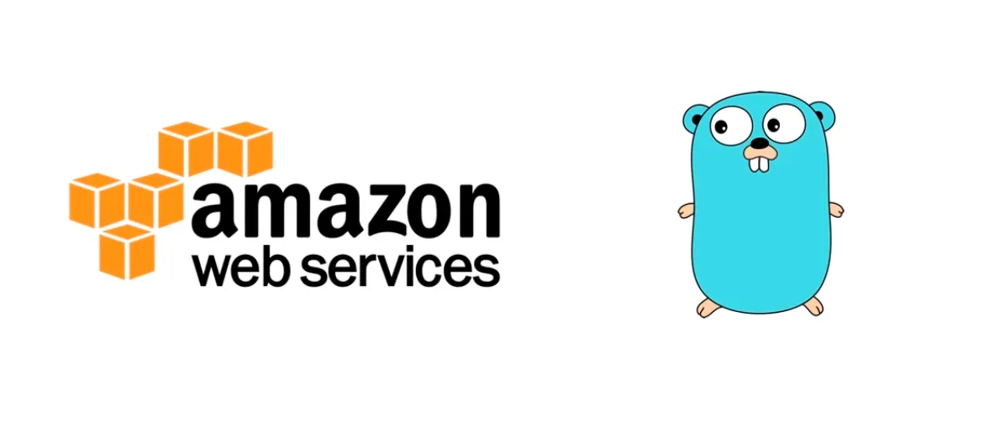

[![Contributors][contributors-shield]][contributors-url]
[![Forks][forks-shield]][forks-url]
[![Stargazers][stars-shield]][stars-url]
[![Issues][issues-shield]][issues-url]
[![MIT License][license-shield]][license-url]
[![LinkedIn][linkedin-shield]][linkedin-url]


<!-- PROJECT LOGO -->
<br />
<div align="center">
  <a href="https://github.com/ChillYao/go-aws-user-login-registration-project">
    
  </a>

  <h3 align="center">A User Login/Regestration App based on GO & AWS</h3>
</div>


<!-- TABLE OF CONTENTS -->
<details>
  <summary>Table of Contents</summary>
  <ol>
    <li>
      <a href="#about-the-project">About The Project</a>
      <ul>
        <li><a href="#built-with">Built With</a></li>
      </ul>
    </li>
    <li>
      <a href="#getting-started">Getting Started</a>
      <ul>
        <li><a href="#prerequisites">Prerequisites</a></li>
        <li><a href="#installation">Installation</a></li>
      </ul>
    </li>
    <li><a href="#usage">Usage</a></li>
    <li><a href="#roadmap">Roadmap</a></li>
    <li><a href="#contributing">Contributing</a></li>
    <li><a href="#license">License</a></li>
    <li><a href="#contact">Contact</a></li>
    <li><a href="#acknowledgments">Acknowledgments</a></li>
  </ol>
</details>


<!-- ABOUT THE PROJECT -->
## About The Project
This Project is built by Golang and AWS. The user can be registered by `/register` and can be loged in by `/login`.

### System Diagram
![System Diagram][system-diagram]

### AWS Cloud Diagram

![AWS Diagram][aws-diagram]
### User Flow Chart

![User Diagram][user-diagram]


<p align="right">(<a href="#readme-top">back to top</a>)</p>


### Built With

This section should list any major frameworks/libraries used to bootstrap your project. Leave any add-ons/plugins for the acknowledgements section. Here are a few examples.

* [![aws][aws]][aws-url]
* [![go][go]][go-url]

<p align="right">(<a href="#readme-top">back to top</a>)</p>


<!-- GETTING STARTED -->
## Getting Started

In order to run this project, you need the following stuff.

### Install Golang
The Golang can be installed by [golang official website](https://go.dev/doc/install)

### Get latest Version of AWS CLI
The latest version of AWS can be installed or updated by [Install/ Update AWS CLI](https://docs.aws.amazon.com/cli/latest/userguide/getting-started-install.html)
### AWS User Permission
- Create the Admin user.
- Get the `access_key_id` and `secret_access_key`.
### Configure AWS CLI
- Configure the short or long term credentials. Details can be checked by [Configuration and credential file settings](https://docs.aws.amazon.com/cli/latest/userguide/cli-configure-files.html)
- confirm the identiy by
  ```sh
  aws s3 ls
  aws sts get-caller-identity
  ```

### Install CDK
Install the AWS CDK by:
```sh
npm install -g aws-cdk
```
For detailed info, it can be found by: [AWS CDK Installation](https://docs.aws.amazon.com/cdk/v2/guide/getting_started.html#getting_started_install).

<p align="right">(<a href="#readme-top">back to top</a>)</p>


<!-- USAGE EXAMPLES -->
## Usage
- Clone/Downlaod this repository.
- Go to the base folder.
- Install all the needed dependencies by:
    ```sh
    go get
    ```
- Go to `lambda` folder, build executable files and zip the lambda to binary function
    ```sh
    cd lambda
    GOOS=linux GOARCH=amd64 go build -o bootstrap
    zip function.zip bootstrap
    ```
- Or this step can be done by running `Makefile` in lambda folder
    ```sh
    cd lambda
    make build
    ```

- Before deployment, the change can be checked by
    ```sh
    cdk diff
    ```

- Deploy the project to AWS by
    ```sh
    cdk deploy
    ```

<p align="right">(<a href="#readme-top">back to top</a>)</p>


<!-- ROADMAP -->
## Roadmap

- [x] CDK Setup and Init
- [x] Creating Serverless Function
- [x] Building and Deploying Lambda
- [x] Creating App Structs
- [x] Setup DynamoDB
- [x] API Handler Setup
- [x] Using Interface to decouple the DB
- [x] Hashing Password
- [x] API Gateway Setup
- [x] Creating JWT
- [x] Middleware Setup

<p align="right">(<a href="#readme-top">back to top</a>)</p>


<!-- CONTACT -->
## Contact

Tong Yao - [@Tong Yao](https://www.linkedin.com/in/tongyaolkd/)

Project Link: [https://github.com/your_username/repo_name](https://github.com/your_username/repo_name)

<p align="right">(<a href="#readme-top">back to top</a>)</p>


<!-- MARKDOWN LINKS & IMAGES -->
<!-- https://www.markdownguide.org/basic-syntax/#reference-style-links -->
[contributors-shield]: https://img.shields.io/github/contributors/othneildrew/Best-README-Template.svg?style=for-the-badge
[contributors-url]: https://github.com/othneildrew/Best-README-Template/graphs/contributors
[forks-shield]: https://img.shields.io/github/forks/othneildrew/Best-README-Template.svg?style=for-the-badge
[forks-url]: https://github.com/othneildrew/Best-README-Template/network/members
[stars-shield]: https://img.shields.io/github/stars/othneildrew/Best-README-Template.svg?style=for-the-badge
[stars-url]: https://github.com/othneildrew/Best-README-Template/stargazers
[issues-shield]: https://img.shields.io/github/issues/othneildrew/Best-README-Template.svg?style=for-the-badge
[issues-url]: https://github.com/othneildrew/Best-README-Template/issues
[license-shield]: https://img.shields.io/github/license/othneildrew/Best-README-Template.svg?style=for-the-badge
[license-url]: https://github.com/othneildrew/Best-README-Template/blob/master/LICENSE.txt
[linkedin-shield]: https://img.shields.io/badge/-LinkedIn-black.svg?style=for-the-badge&logo=linkedin&colorB=555
[linkedin-url]: https://linkedin.com/in/othneildrew
[system-diagram]: readme-static/system-diagram.png
[aws-diagram]: readme-static/aws-diagram.png
[user-diagram]: readme-static/user-diagram.png
[aws]: https://img.shields.io/badge/Amazon_AWS-232F3E?style=for-the-badge&logo=amazon-aws&logoColor=white
[aws-url]: https://aws.amazon.com/
[go]: https://img.shields.io/badge/go-%2300ADD8.svg?style=for-the-badge&logo=go&logoColor=white
[go-url]: https://go.dev/
